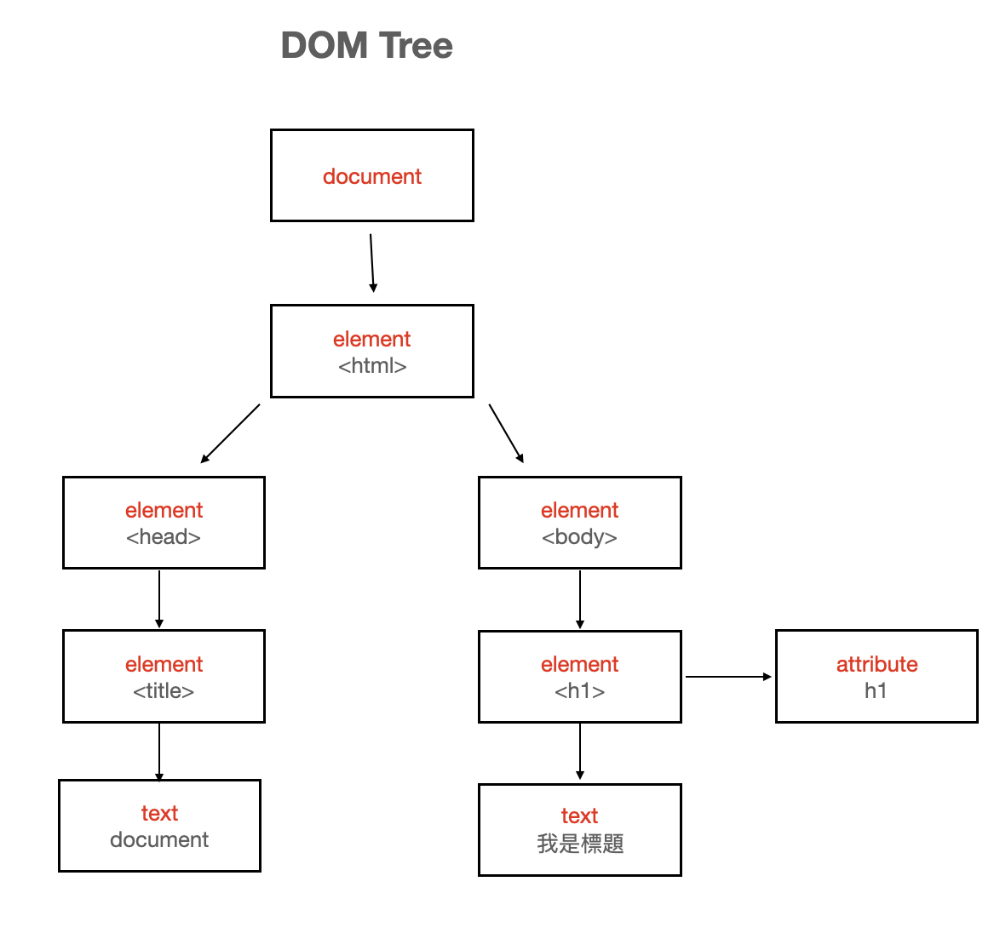
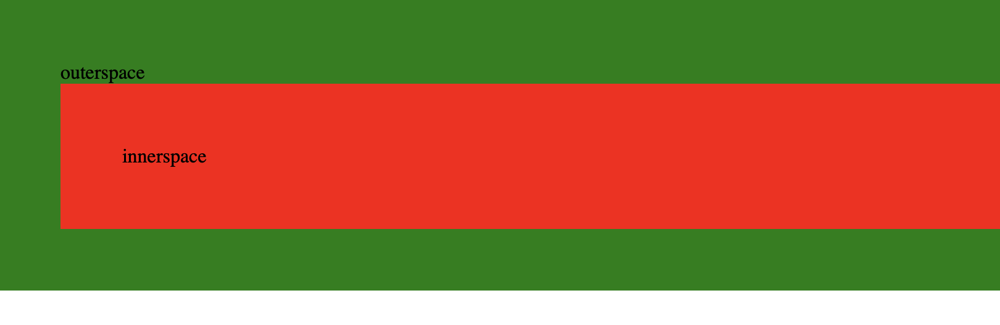
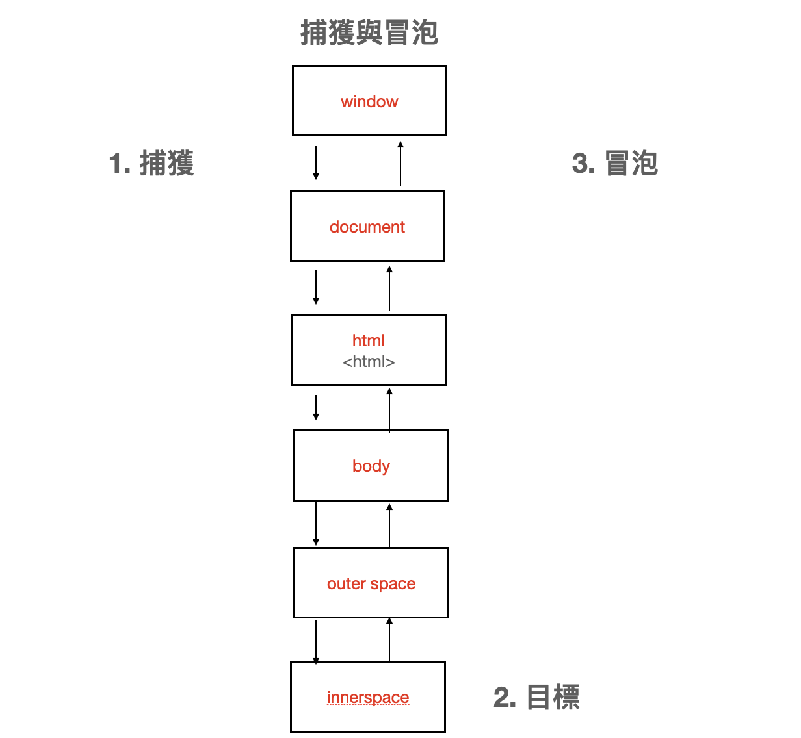

## 什麼是 DOM？
DOM 全名為 Document Object Model，中文翻譯為文件物件模型。DOM 以樹狀結構的模式展現 Document 裡的元素，每個元素為一個節點。DOM 讓設計瀏覽器時可以遵循同一種方式來解析 Document，也方便工程師們使用 JS 控制各個節點，也就是 HTML 元素。節點又可分為：   
1. document  
2. element  
3. text  
4. attribute  
document 是原文件，所有節點都從此開始。element 是文件裡的各個 html 標籤，text 是被標籤包裹著的文字，attribute 是標籤的屬性，class 就是一種 attribute。
範例如下：

``` html
<!DOCTYPE html> 
<html lang="en">   
<head>   
    <title>Document</title>   
</head>   
<body>   
    <h1 class='h1'>我是標題</h1>   
</body>  
</html>  
```
上列 html 原始碼的 DOM tree 如下：



## 事件傳遞機制的順序是什麼；什麼是冒泡，什麼又是捕獲？
網頁的內容由一個又一個的 html 標籤包裹著，當我們點擊某一內容時，不只包裹著它的 html 標籤會被影響到，包裹這個標籤的標籤也會被影響到，這個過程稱作事件傳遞機制。

```
<!DOCTYPE html>
<html lang="en">
<head>
    <title>Document</title>
</head>
<body>
    <div class='outerspace'>
        outerspace
        <div class='innerspace'>
            innerspace
        </div>
    </div>
</body>
</html>
```
上列的原始碼顯示出的圖如下：

當我們點擊， innerspace 的時候，這個內容是被 `<div>` 包裹著，但因為這個 `<div>` 是被另一個 `<div class='outerspace>` 包著，所以我們對 innerspace 的點擊，也會影響到 outerspace。
這一層層影響的過程就稱作事件傳遞機制。其中，這個過程又可以細分為捕獲與冒泡，範例如下圖：

當我們點擊 innerspace 的時候，開啟 event capturing 到 target 也就是 innerspace 再從一路 event bubbling 到 window。


## 什麼是 event delegation，為什麼我們需要它？
```
    <div class="parent">
        <div class="child"></div>
        <div class="child"></div>
        <div class="child"></div>
        <div class="child"></div>
    </div>
```
Event Delegation 翻作**事件代理**。得益於 Event Bubbling，當我們點擊任何一個 `<div class="child"></div>` 的時候，我們也點擊到 `<div class="parent">`，所以如果我們需要加上 `event.listener`，我們只需要加在 `<div class="parent">` 就可以監聽它底下所有事件了，換句話說，就是由 `<div class="parent">` 代理監聽底下 `div class="child"></div>` 的事件。


## event.preventDefault() 跟 event.stopPropagation() 差在哪裡，可以舉個範例嗎？
`event.preventDefault()` 可以停止 DOM element 的默認動作，像是停止 `<a>` 的超連結功能。   
舉例來說，下列程式碼，倒數第五行的 `event.preventDefault()` 停止了 ckeckbox 的預設功能，讓使用者無法在框框內打勾：

```
<!DOCTYPE html>
<html>
<head>
<title>preventDefault example</title>
</head>

<body>
    <p>Please click on the checkbox control.</p>
    <form>
        <label for="id-checkbox">Checkbox</label>
        <input type="checkbox" id="id-checkbox"/>
    </form>
    <script>
        document
	        .querySelector("#id-checkbox")
	        .addEventListener("click", function(event){
	            alert("preventDefault will stop you from checking this checkbox!")
	            event.preventDefault();
	        });
    </script>
</body>
</html>
```

而 `event.stopPropagation()` 能夠讓下層元素停止冒泡到上層元素，舉例來說：

```
<!DOCTYPE html>
<html lang="en">
<head>
    <meta charset="UTF-8">
    <meta http-equiv="X-UA-Compatible" content="IE=edge">
    <meta name="viewport" content="width=device-width, initial-scale=1.0">
    <title>Document</title>
</head>
<body>
<div id='div1'>
    <a id="hyper" href="https://dotblogs.com.tw/harry">Harry's Tech World</a>
</div>

</body>
<script>

document
    .querySelector('#hyper')
    .addEventListener('click', function(e){
        event.preventDefault();
        event.stopPropagation();
        console.log(`you've clicked hyper`)
    })

document
    .querySelector('#div1')
    .addEventListener('click', function(e){
        event.preventDefault();
        console.log(`you've clicked div1`)
    })
</script>
</script>
</html>
```
倒數第十三行的 `event.stopPropagation()` 停止了 `#hyper` 的 event bubbling，所以點擊超連結時只會 console you've clicked hyper。


參考資料：  
[Day03-深入理解網頁架構：DOM](https://ithelp.ithome.com.tw/articles/10202689)   
[[JavaScript] Javascript 中的 DOM 事件傳遞機制：捕獲與冒泡 (capturing and bubbling)](https://medium.com/itsems-frontend/javascript-event-bubbling-capturing-794cd2d01e61)